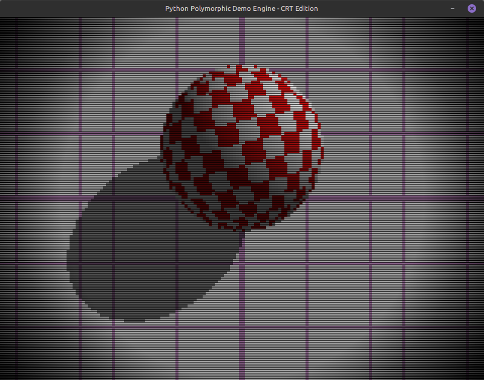
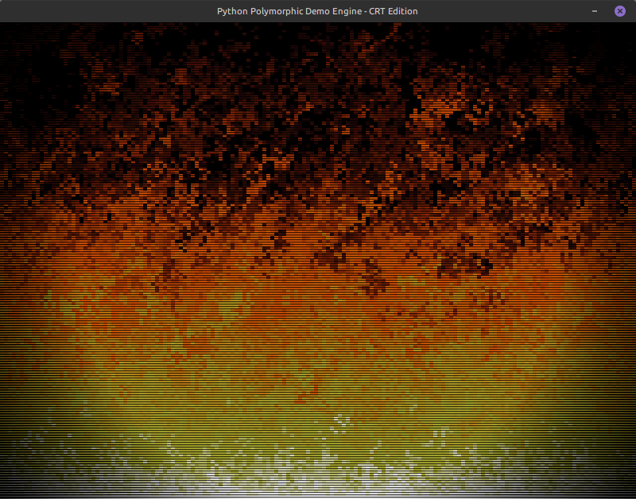

# Python Polymorphic Demo Engine

A polymorphic demoscene engine in Python cleanly separates the main event loop from the individual graphic routines, allowing you to sequence disparate effects—like a pixel fire transitioning into an Amiga Boing Ball—without cluttering the main loop with effect-specific state.

